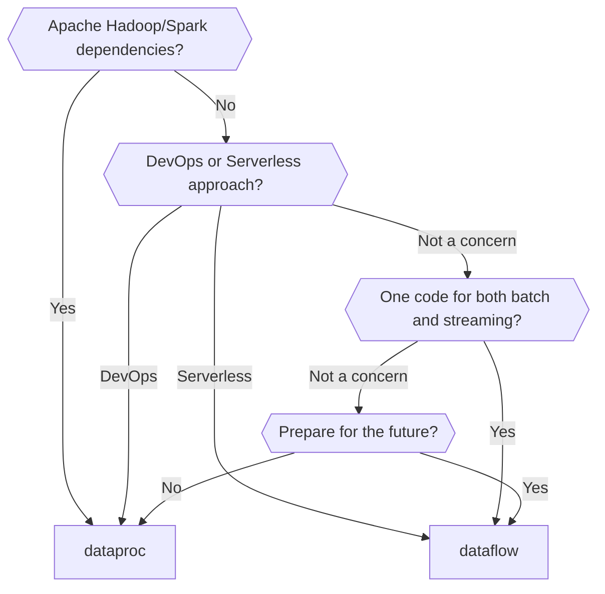
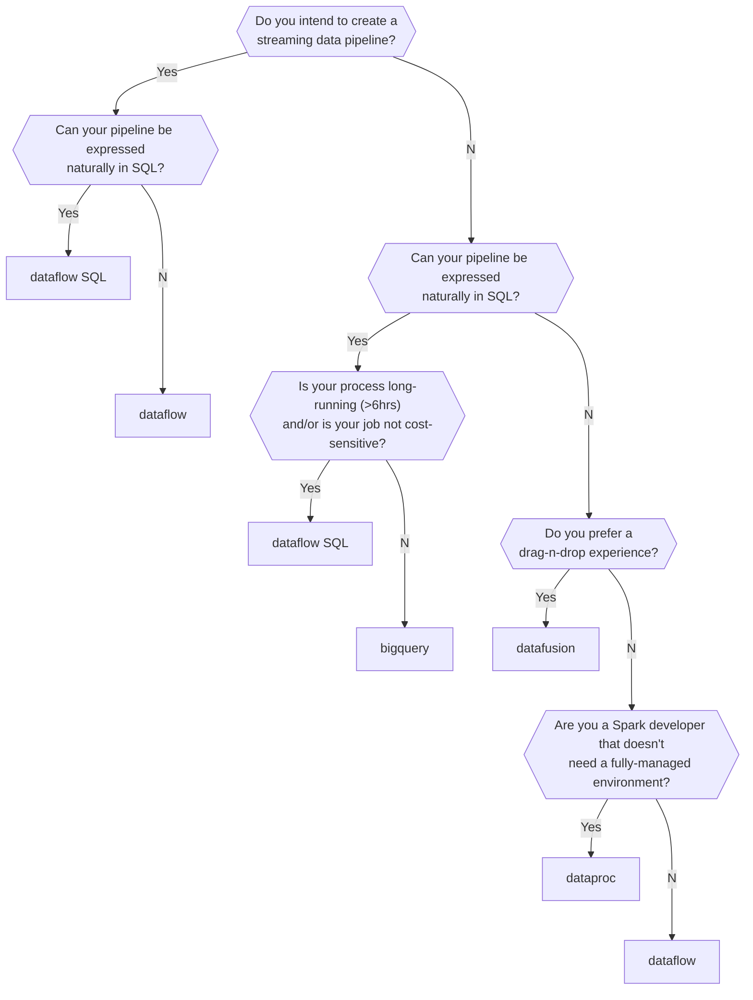

![[Pasted image 20220510183506.png|700]]

```mermaid
flowchart
	%% Nodes
	dataproc
	dataflow
	
	%% Decisions
	dec_deps{{Apache Hadoop/Spark dependencies?}}
	dec_devops{{DevOps or Serverless approach?}}
	dec_onecode{{One code for both batch and streaming?}}
	dec_future{{Prepare for the future?}}


	%% Links
	
	dec_deps-- No -->dec_devops
	dec_devops-- Not a concern -->dec_onecode

	dec_deps-- Yes --> dataproc
	dec_devops-- DevOps --> dataproc
	dec_onecode-- Not a concern --> dec_future
	dec_future-- No --> dataproc

	
	dec_devops-- Serverless --> dataflow
	dec_onecode-- Yes --> dataflow
	dec_future-- Yes --> dataflow

class dataproc,dataflow internal-link;
```

![[Pasted image 20220523153311.png|700]]

```mermaid
flowchart
	%% Nodes

	beam_sql[dataflow SQL]
	dataflow
	datafusion
	dataproc
	dataflow2[dataflow]
	beam_sql2[dataflow SQL]
	bigquery

	%% Decisions

	dec_streaming{{Do you intend to create a<br>streaming data pipeline?}}
	dec_sql_strea{{Can your pipeline be expressed<br>naturally in SQL?}}
	dec_sql_batch{{Can your pipeline be expressed<br>naturally in SQL?}}
	dec_drag_drop{{Do you prefer a<br>drag-n-drop experience?}}
	dec_spark{{Are you a Spark developer that doesn't<br>need a fully-managed environment?}}
	dec_long{{"Is your process long-running (>6hrs)<br>and/or is your job not cost-sensitive?"}}

	%% Links
	dec_streaming --Yes--> dec_sql_strea
	dec_sql_strea --Yes-->beam_sql
	dec_sql_strea --No-->dataflow
	
	dec_streaming --No--> dec_sql_batch
	dec_sql_batch --Yes--> dec_long
	dec_long --Yes--> beam_sql2
	dec_long --No--> bigquery
	dec_sql_batch --No--> dec_drag_drop
	dec_drag_drop --Yes--> datafusion
	dec_drag_drop --No--> dec_spark
	dec_spark --Yes-->dataproc
	dec_spark --No--> dataflow2

class dataflow,dataflow2,datafusion,dataproc,bigquery internal-link;
```