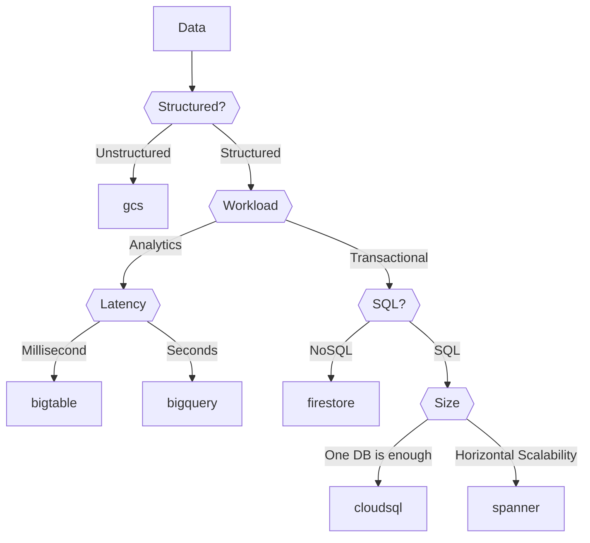

All services fully managed

![[Pasted image 20220425142117.png|700]]

![[Pasted image 20220425155558.png|700]]

```mermaid
graph
	%% Nodes
	Data
	gcs
	cloudsql
	spanner
	bigtable
	bigquery
	firestore

	%% Decisions
	dec_structured{{Structured?}}
	dec_workload{{Workload}}
	dec_latency{{Latency}}
	dec_sql{{SQL?}}
	dec_size{{Size}}

	%% Links
	Data --> dec_structured
	dec_structured -- Unstructured --> gcs
	dec_structured -- Structured --> dec_workload
	dec_workload -- Transactional --> dec_sql
	dec_sql -- SQL --> dec_size
	dec_size -- One DB is enough --> cloudsql
	dec_size -- Horizontal Scalability --> spanner
	dec_sql -- NoSQL --> firestore
	dec_workload -- Analytics --> dec_latency
	dec_latency -- Millisecond --> bigtable
	dec_latency -- Seconds --> bigquery

class gcs,cloudsql,spanner,bigtable,bigquery,firestore internal-link;
```
