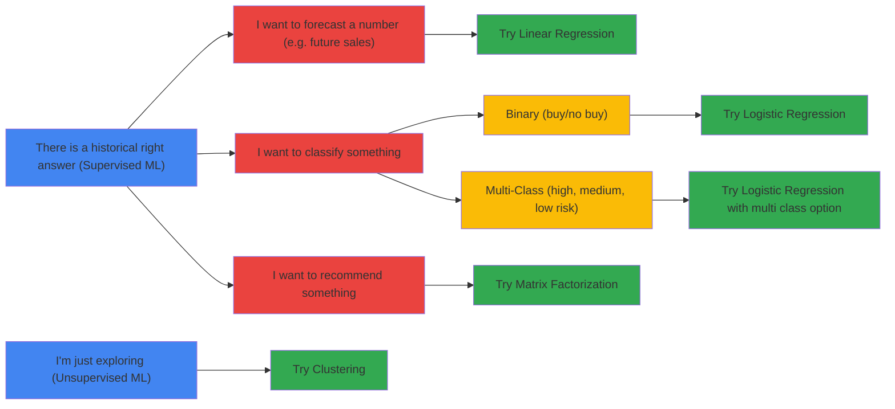

# Algorithms

![[Pasted image 20220429110430.png|700]]

## Classification

Advanced models:

- #dnn (Deep Neural Networks) - Model non-linear relationships in the data (ex: car price evaluation)
- Gradient boosted trees / #xgboost - Iteratively fit a decision tree to the residuals of preceeding decision trees

## Regression

- DNN Regression - Non linear regression
- XGBoost

## Matrice factorization

Used to create recommendations for users

## K-means clustering

Unsupervised

Explore paterns in the data by grouping data into cluster

Utility: get insights from clustering with statistics analysis to identify what's special about each cluster

# Methods

## Anomaly detection

> #anomaly #detection also known as #outlier detection is the process of finding data points within a dataset that differs from the rest. Common applications of anomaly detection includes fraud detection in financial transactions, fault detection and predictive maintenance.
> Broadly speaking, anomaly detection can be categorized into _#supervised_ and _#unsupervised_ realm. Supervised anomaly detection requires labelled dataset that indicates if a record is “normal” or “abnormal”. Unsupervised anomaly detection involves an unlabeled dataset. It assumes that the majority data points in the unlabeled dataset are “normal” and it looks for data points that differs from the “normal” data points.

[Source](https://towardsdatascience.com/unsupervised-anomaly-detection-in-python-f2e61be17c2b)

## Reinforcement learning

> #reinforcement learning is a method based on rewarding desired behaviors and/or punishing undesired ones. In general, a reinforcement learning agent is able to perceive and interpret its environment, take actions and learn through trial and error.

[Source](https://www.techtarget.com/searchenterpriseai/definition/reinforcement-learning)

## Overfitting

Overfitting is when a model is so close to its training data that it cannot adapt to the data used for prediction.

The tools to prevent overfitting: less variables, regularization, early ending on the training.

- Adding more training data will increase the complexity of the training set and help with the variance problem.
- Reducing the feature set will ameliorate the overfitting and help with the variance problem.
- Increasing the regularization parameter will reduce overfitting and help with the variance problem.

### Methods

#### Regularization

Use L1 regularization when you need to assign greater importance to more influential features. It shrinks less important feature to 0.

L2 regularization performs better when all input features influence the output & all with the weights are of equal size.

Parametrization of regularization is very important. If the parameter is too high, the model becomes too simple and tends to *underfit*. On the other hand, if the parameter is too low, the effect of regulatization becomes negligible and the model is likely to *overfit*.

#### Dropout methods

Used for neural networks

#### Dimensionailty reduction

Used for normal md models
